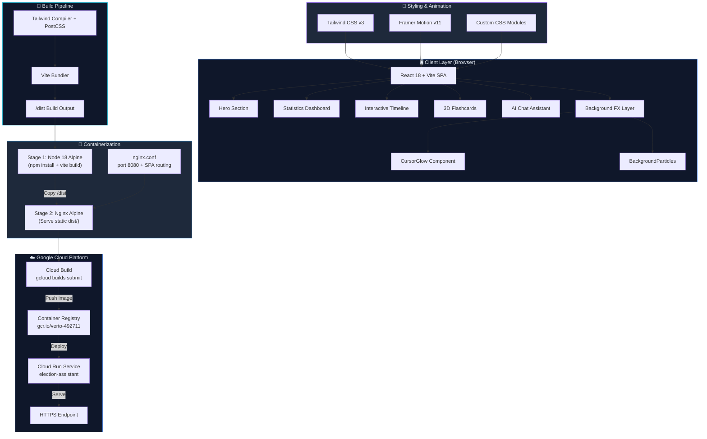
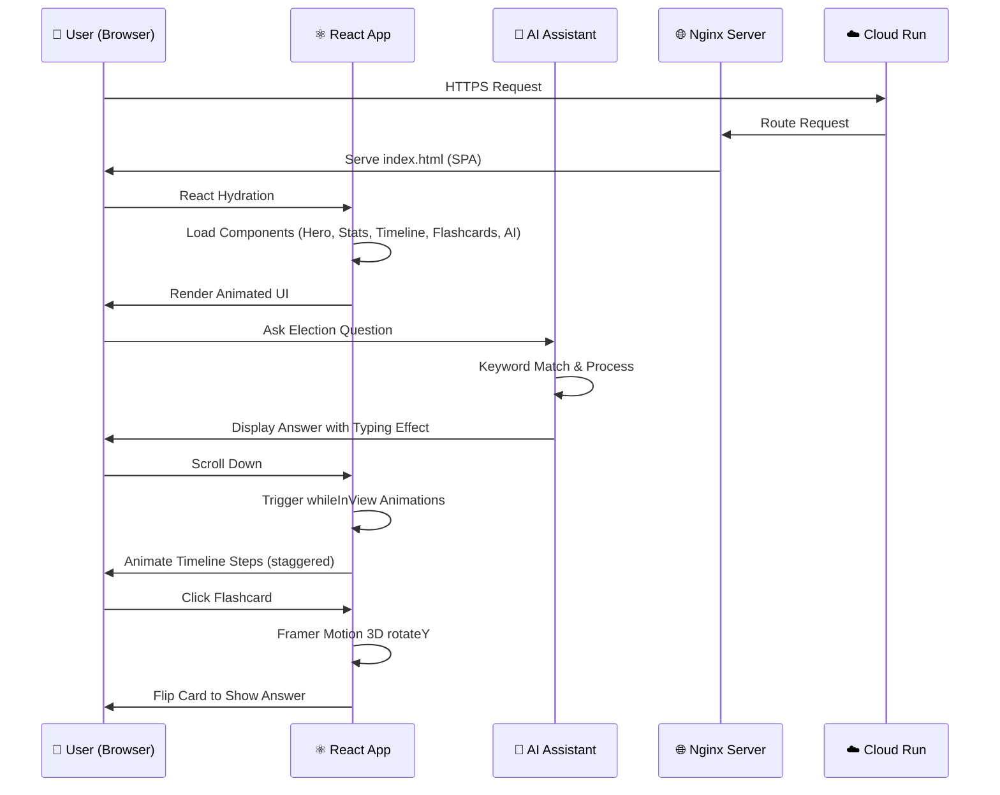
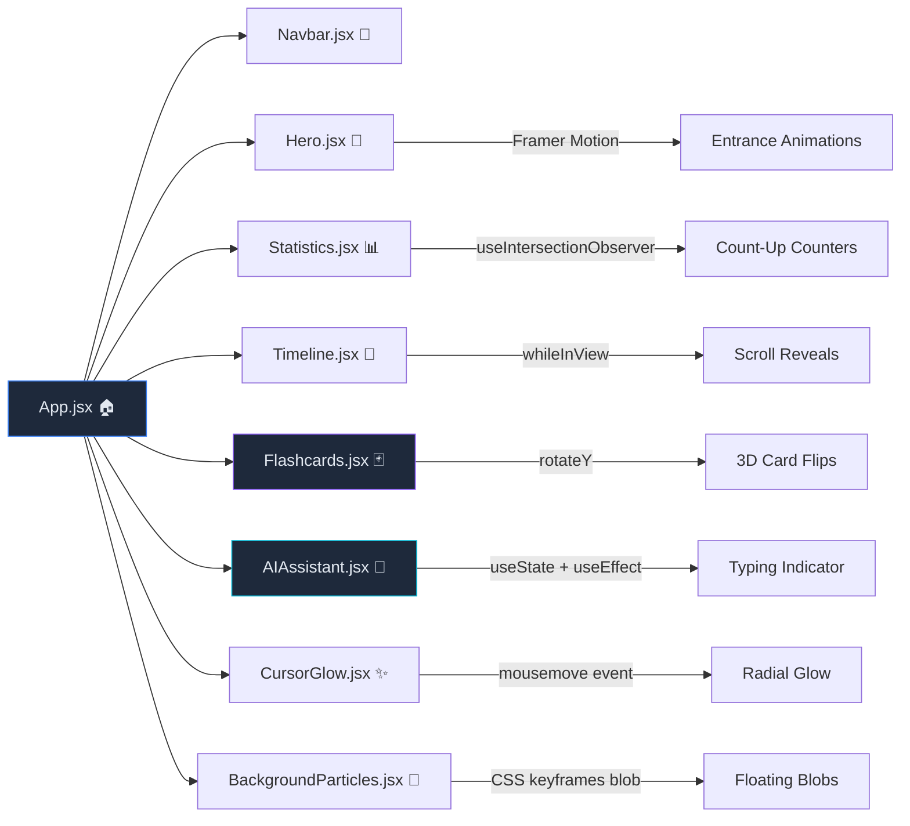

# 🗳️ Navigate Democracy with Intelligent Assistance

<div align="center">


[](https://reactjs.org/)
[](https://vitejs.dev/)
[](https://tailwindcss.com/)
[](https://www.framer.com/motion/)
[](https://www.docker.com/)
[](https://cloud.google.com/run)
[](https://opensource.org/licenses/MIT)

**A futuristic, AI-powered civic-tech platform that guides citizens through the election process with intelligence and elegance.**

[Live Demo](#) · [Report Bug](https://github.com/Navneet-technoxian-alt/Navigate-Democracy-with-Intelligent-Assistance/issues) · [Request Feature](https://github.com/Navneet-technoxian-alt/Navigate-Democracy-with-Intelligent-Assistance/issues)

</div>

---

## 📖 Overview

**Navigate Democracy with Intelligent Assistance** (ElecAssist) is a next-generation civic-technology web application designed to make the democratic process transparent, accessible, and engaging for every citizen. Built with a futuristic glassmorphism UI, real-time animated statistics, an interactive election timeline, and an AI-powered chat assistant — this platform bridges the gap between citizens and the democratic process.

Whether you're a first-time voter or a seasoned participant, ElecAssist provides clear, step-by-step guidance through registration, voting, candidate research, and result understanding — all wrapped in a stunning, cinematic dark-themed interface.

---

## ✨ Key Features

| Feature | Description |
|---|---|
| 🤖 **AI Chat Assistant** | Intelligent Q&A chatbot that answers election-related queries using keyword matching and contextual responses |
| 📅 **Interactive Timeline** | Animated step-by-step election process timeline with scroll-triggered reveals |
| 📊 **Live Statistics Dashboard** | Real-time animated counters showing voter turnout, registered candidates, and polling stations |
| 🃏 **3D Flashcards** | Interactive flashcards with smooth 3D flip animations for learning election concepts |
| 🌌 **Cursor Glow Effect** | Cinematic cursor-tracking lighting that creates atmospheric depth |
| ✨ **Floating Particles** | Animated background particles using blob animations for visual depth |
| 📱 **Fully Responsive** | Mobile-first design that works flawlessly on all screen sizes |
| 🚀 **Cloud Run Ready** | Fully containerized with Docker + Nginx, optimized for Google Cloud Run |

---

## 🏗️ System Architecture



---

## 🔄 Application Flow



---

## 🧩 Component Architecture



---

## 🚀 Getting Started

### Prerequisites

- **Node.js** 18+ and npm
- **Docker** (for containerized deployment)
- **Google Cloud SDK** (for Cloud Run deployment)

### 1. Clone the Repository

```bash
git clone https://github.com/Navneet-technoxian-alt/Navigate-Democracy-with-Intelligent-Assistance.git
cd Navigate-Democracy-with-Intelligent-Assistance
```

### 2. Install Dependencies

```bash
npm install
```

### 3. Run Development Server

```bash
npm run dev
```

Open [http://localhost:5173](http://localhost:5173) in your browser.

### 4. Build for Production

```bash
npm run build
```

---

## 🐳 Docker Deployment

### Build the Docker Image Locally

```bash
docker build -t election-assistant .
docker run -p 8080:8080 election-assistant
```

Open [http://localhost:8080](http://localhost:8080) to view the containerized app.

---

## ☁️ Deploy to Google Cloud Run

### Step 1: Authenticate with GCP

```bash
gcloud auth login
gcloud config set project verto-492711
```

### Step 2: Enable Required APIs

```bash
gcloud services enable run.googleapis.com cloudbuild.googleapis.com artifactregistry.googleapis.com
```

### Step 3: Build & Push Docker Image

```bash
gcloud builds submit --tag gcr.io/verto-492711/election-assistant .
```

### Step 4: Deploy to Cloud Run

```bash
gcloud run deploy election-assistant \
  --image gcr.io/verto-492711/election-assistant \
  --platform managed \
  --region us-central1 \
  --allow-unauthenticated \
  --port 8080
```

### Step 5: Get the Service URL

```bash
gcloud run services describe election-assistant \
  --region us-central1 \
  --format="value(status.url)"
```

---

## 🛠️ Tech Stack

| Category | Technology | Version |
|---|---|---|
| **Framework** | React | 18 |
| **Build Tool** | Vite | 5 |
| **Styling** | Tailwind CSS | 3.4 |
| **Animations** | Framer Motion | 11 |
| **Icons** | Lucide React | Latest |
| **Intersection Observer** | react-intersection-observer | Latest |
| **Web Server** | Nginx Alpine | Latest |
| **Containerization** | Docker (multi-stage) | Latest |
| **Cloud Platform** | Google Cloud Run | Managed |
| **CI/CD** | Google Cloud Build | Managed |

---

## 📁 Project Structure

```
Navigate-Democracy-with-Intelligent-Assistance/
├── 📁 public/
│   ├── favicon.svg
│   └── icons.svg
├── 📁 src/
│   ├── 📁 assets/
│   │   └── hero.png
│   ├── 📁 components/
│   │   ├── AIAssistant.jsx      # AI chatbot with typing animation
│   │   ├── AIAssistant.css
│   │   ├── BackgroundParticles.jsx  # Floating blob animations
│   │   ├── CursorGlow.jsx       # Mouse-tracking cinematic glow
│   │   ├── Flashcards.jsx       # 3D flip interactive cards
│   │   ├── Flashcards.css
│   │   ├── Hero.jsx             # Full-screen hero section
│   │   ├── Hero.css
│   │   ├── Navbar.jsx           # Glassmorphism sticky nav
│   │   ├── Statistics.jsx       # Animated live-style counters
│   │   ├── Timeline.jsx         # Scroll-triggered election timeline
│   │   └── Timeline.css
│   ├── App.jsx                  # Root component
│   ├── App.css
│   ├── index.css                # Tailwind directives + custom utilities
│   └── main.jsx                 # React entry point
├── 📄 Dockerfile                # Multi-stage build (Node → Nginx)
├── 📄 nginx.conf                # SPA routing + port 8080
├── 📄 .gcloudignore             # Excludes node_modules from Cloud Build
├── 📄 tailwind.config.js        # Custom theme: neon, glassmorphism
├── 📄 vite.config.js
├── 📄 postcss.config.js
└── 📄 package.json
```

---

## 🎨 Design System

The app uses a custom dark glassmorphism design system defined in `tailwind.config.js`:

| Token | Value | Usage |
|---|---|---|
| `dark-900` | `#030712` | Deep space background |
| `dark-800` | `#0f172a` | Card/panel backgrounds |
| `primary` | `#3b82f6` | Neon blue — CTAs, accents |
| `cyan` | `#06b6d4` | Bright cyan — highlights |
| `accent` | `#8b5cf6` | Deep purple — special elements |
| `glass-panel` | `backdrop-blur-xl + bg-dark-800/40` | Glassmorphism panels |
| `shadow-neon-blue` | `0 0 15px rgba(59,130,246,0.5)` | Glow effects |

---

## 🤝 Contributing

Contributions are welcome! Please follow these steps:

1. Fork the repository
2. Create your feature branch (`git checkout -b feature/AmazingFeature`)
3. Commit your changes (`git commit -m 'Add some AmazingFeature'`)
4. Push to the branch (`git push origin feature/AmazingFeature`)
5. Open a Pull Request

---

## 📄 License

This project is licensed under the **MIT License** — see the [LICENSE](LICENSE) file for details.

---

## 👤 Author

**Navneet Technoxian**
- GitHub: [@Navneet-technoxian-alt](https://github.com/Navneet-technoxian-alt)
- Project: [Navigate Democracy with Intelligent Assistance](https://github.com/Navneet-technoxian-alt/Navigate-Democracy-with-Intelligent-Assistance)

---

<div align="center">

**⭐ Star this repo if you found it helpful!**

Made with ❤️ and ☕ for a better democracy

</div>
